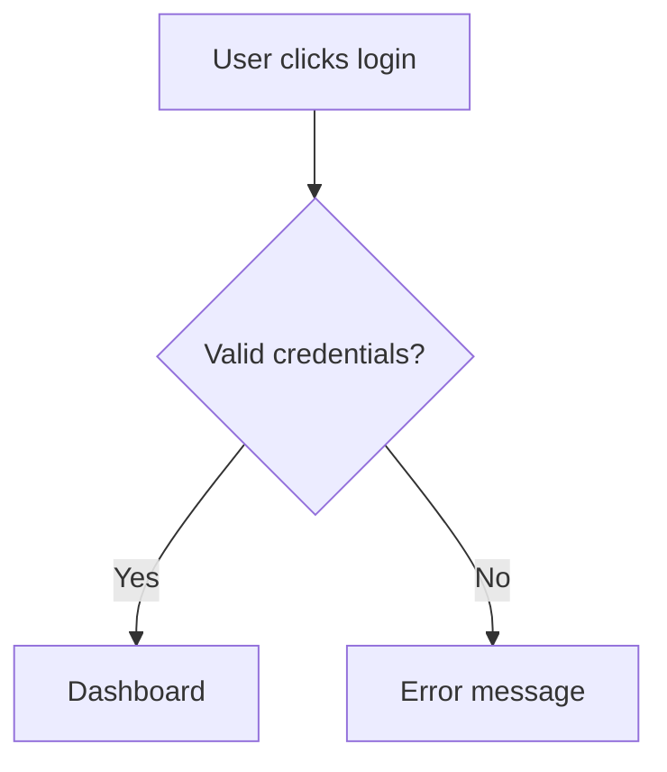
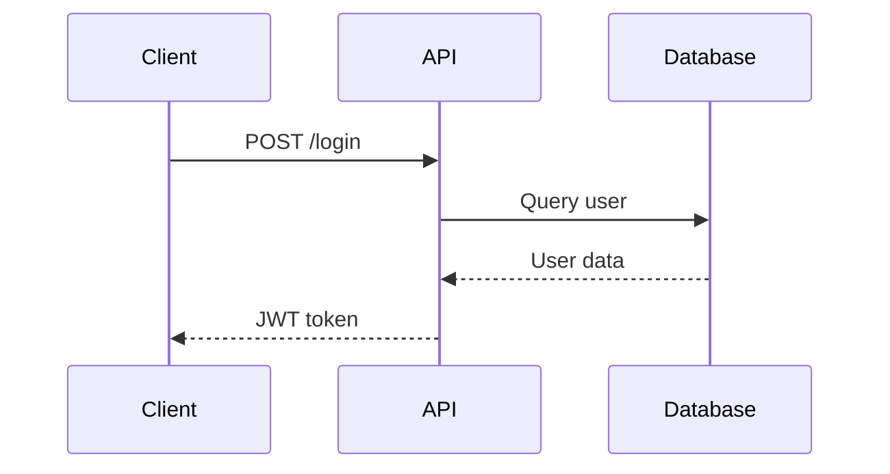

# Agent Tools Reference - Domain Zero Protocol

**Version**: 1.0.0
**Created**: November 9, 2025
**Purpose**: Define which tools each agent can use and operational boundaries

---

## 📋 Table of Contents

- [Overview](#overview)
- [Available Tools](#available-tools)
- [Agent Tool Matrix](#agent-tool-matrix)
- [Agent-Specific Tool Usage](#agent-specific-tool-usage)
- [Tool Restrictions](#tool-restrictions)
- [Safety Guidelines](#safety-guidelines)

---

## Overview

In the Domain Zero Protocol, agents have access to specific **tools** (functions) that enable them to perform their domain responsibilities. Tool access is carefully bounded to prevent scope creep and maintain clear separation of concerns.

**Key Principle**: Each agent only has access to tools necessary for their domain. This enforces boundaries and prevents agents from overstepping their responsibilities.

---

## Available Tools

### Standard Tools

These are the core tools available in Claude Code and similar LLM environments:

| Tool | Purpose | Risk Level |
|------|---------|------------|
| **Read** | Read files from filesystem | Low |
| **Write** | Create new files | Medium |
| **Edit** | Modify existing files | Medium |
| **Bash** | Execute shell commands | High |
| **Grep** | Search file contents (ripgrep) | Low |
| **Glob** | Find files by pattern | Low |
| **TodoWrite** | Manage task lists | Low |
| **Task** | Launch specialized sub-agents | Medium |
| **WebFetch** | Fetch and analyze web content | Low |
| **WebSearch** | Search the web | Low |

### Advanced Tools

These are specialized tools for advanced workflows:

| Tool | Purpose | Risk Level | Agents |
|------|---------|------------|--------|
| **NotebookEdit** | Edit Jupyter notebook cells | Medium | Yuuji, Todo, Maki |
| **BashOutput** | Monitor background shell output | Low | Panda, Maki, Todo |
| **KillShell** | Terminate background processes | Medium | Panda, Gojo |
| **SlashCommand** | Execute custom slash commands | Medium | Gojo, Yuuji |
| **Skill** | Invoke specialized skills | Medium | All agents (context-dependent) |

### Advanced Tool Capabilities

**Parallel Tool Execution**:
- Multiple independent tool calls in single message
- Example: Read 3 files simultaneously for comparison

**Background Process Management**:
- Long-running commands (dev servers, watchers, builds)
- Monitor output with BashOutput
- Terminate with KillShell

**IDE Integration**:
- Clickable file references ([filename:line](path))
- Code block language specifiers
- Mermaid diagram support

---

## Agent Tool Matrix

| Agent | Read | Write | Edit | Bash | Grep | Glob | TodoWrite | Task | WebFetch | WebSearch |
|-------|------|-------|------|------|------|------|-----------|------|----------|-----------|
| **Gojo** | ✅ | ❌ | ❌* | ✅* | ✅ | ✅ | ✅ | ✅ | ✅ | ✅ |
| **Yuuji** | ✅ | ✅ | ✅ | ✅ | ✅ | ✅ | ✅ | ✅ | ⚠️ | ⚠️ |
| **Megumi** | ✅ | ⚠️ | ⚠️ | ✅ | ✅ | ✅ | ✅ | ✅ | ✅ | ✅ |
| **Nobara** | ✅ | ✅ | ✅ | ⚠️ | ✅ | ✅ | ✅ | ⚠️ | ✅ | ✅ |
| **Panda** | ✅ | ✅ | ✅ | ✅ | ✅ | ✅ | ✅ | ⚠️ | ⚠️ | ❌ |
| **Maki** | ✅ | ⚠️ | ✅ | ✅ | ✅ | ✅ | ✅ | ⚠️ | ⚠️ | ❌ |
| **Inumaki** | ✅ | ✅ | ✅ | ⚠️ | ✅ | ✅ | ✅ | ⚠️ | ✅ | ⚠️ |
| **Todo** | ✅ | ✅ | ✅ | ✅ | ✅ | ✅ | ✅ | ⚠️ | ⚠️ | ❌ |

**Legend**:
- ✅ **Full Access**: Agent uses this tool regularly for their domain
- ⚠️ **Restricted**: Agent can use but only for specific domain tasks
- ❌ **Prohibited**: Agent should not use this tool
- ❌* **Special Exception**: Conditional access (see agent details)

---

## Agent-Specific Tool Usage

### 🌀 SATORU GOJO - Mission Control & Protocol Guardian

**Domain**: Project orchestration, protocol enforcement, work session monitoring

#### ✅ Authorized Tools

**Read**:
- Read protocol files (CLAUDE.md, YUUJI.md, etc.)
- Read project state (.protocol-state/*)
- Read configuration (protocol.config.yaml)
- Read dev-notes.md for session tracking
- **Cannot read**: User's private files without explicit task

**Bash** (Restricted):
- ✅ **Allowed**:
  - Run verification scripts (`./scripts/verify-protocol.sh`)
  - Check git status (`git status`, `git log`)
  - Run project-specific safe commands (npm test, npm run build)
  - Execute protocol compliance checks
- ❌ **Prohibited**:
  - Destructive operations (`rm -rf`, `git reset --hard`)
  - System modifications
  - Installing packages without user approval

**Grep/Glob**:
- Search for protocol violations
- Find configuration files
- Search dev-notes.md for tags (@security-review, etc.)

**TodoWrite**:
- Manage project-level task lists
- Track multi-agent coordination tasks
- Monitor work session milestones

**Task**:
- Launch specialized agents for complex coordination
- Delegate to Explore agent for codebase analysis

**WebFetch/WebSearch**:
- Fetch canonical protocol from GitHub
- Check for protocol updates
- Research best practices

**Edit** (EXTREMELY RESTRICTED):
- ❌ **Generally Prohibited**: Gojo does NOT edit files
- ✅ **ONLY Exception**: CLAUDE.md (with explicit user authorization and Tier 2 authority)
- **Rationale**: Gojo is orchestrator, not implementer. Delegates to Yuuji for file modifications.

**Write**:
- ❌ **Prohibited**: Gojo does not create files, delegates to appropriate agents

#### 🎯 Tool Usage Examples

```bash
# Gojo checks protocol compliance
Read: protocol/CLAUDE.md
Bash: ./scripts/verify-protocol.sh
Grep: Search dev-notes.md for "@security-review-pending"

# Gojo coordinates release
TodoWrite: Add tasks [1. Build, 2. Test, 3. Deploy]
Task: Launch agents for each phase
Bash: git status (check clean working tree)
```

---

### ⚡ YUUJI ITADORI - Implementation Specialist

**Domain**: Feature implementation, test-first development

#### ✅ Authorized Tools

**Read**:
- Read source code files
- Read test files
- Read requirements/specs
- Read dev-notes.md

**Write**:
- ✅ **Primary Tool**: Create new source files, test files
- Create new components, modules, utilities
- **Cannot write**: CLAUDE.md, protocol files (forbidden)

**Edit**:
- ✅ **Primary Tool**: Modify existing source code
- Refactor implementations
- Update tests
- **Cannot edit**: CLAUDE.md, protocol files (forbidden)

**Bash**:
- ✅ **Allowed**:
  - Run tests (`npm test`, `pytest`, etc.)
  - Run linters (`npm run lint`)
  - Git operations (`git add`, `git commit`, `git push`)
  - Build commands (`npm run build`)
- ⚠️ **Use with caution**:
  - Installing dependencies (ask user first)
- ❌ **Prohibited**:
  - System modifications
  - Destructive operations

**Grep/Glob**:
- Search codebase for examples
- Find files to modify
- Search for TODOs

**TodoWrite**:
- Track implementation tasks
- Manage TDD workflow (red-green-refactor)

**Task**:
- Launch Explore agent for codebase understanding
- Delegate complex searches

**WebFetch/WebSearch** (Restricted):
- ⚠️ Only for documentation research (API docs, framework guides)
- **Must not**: Browse unrelated content

#### 🎯 Tool Usage Examples

```bash
# Yuuji implements user authentication
Read: src/auth/* (understand existing code)
Write: src/auth/register.ts (new file)
Edit: src/auth/index.ts (add export)
Bash: npm test -- auth.test.ts (run tests)
TodoWrite: [✅ Write test, ✅ Implement, ⏳ Refactor]
```

---

### 🛡️ MEGUMI FUSHIGURO - Security Analyst

**Domain**: Security reviews, threat modeling, OWASP audits

#### ✅ Authorized Tools

**Read**:
- ✅ **Primary Tool**: Read code to review for vulnerabilities
- Read authentication/authorization code
- Read API endpoints
- Read configuration files

**Edit** (Restricted):
- ⚠️ **Limited**: Only to fix security vulnerabilities
- Must coordinate with Yuuji for implementation
- **Preferred**: Report issues, let Yuuji implement fixes

**Write** (Restricted):
- ⚠️ **Limited**: Only to create security reports (Trigger 19)
- Write security documentation
- **Generally**: Prefers reporting over implementation

**Bash**:
- ✅ **Allowed**:
  - Run security scanners (`npm audit`, `snyk test`)
  - Check for leaked secrets (`git-secrets`, `trufflehog`)
  - Run OWASP ZAP or similar tools (if available)
- ❌ **Prohibited**:
  - Destructive operations

**Grep/Glob**:
- ✅ **Primary Tool**: Search for security vulnerabilities
- Find hardcoded secrets, SQL injection risks
- Search for XSS vectors
- Find authentication bypasses

**TodoWrite**:
- Track security review findings
- Manage vulnerability remediation tasks

**Task**:
- Launch specialized security analysis agents

**WebFetch/WebSearch**:
- Research CVEs
- Check OWASP documentation
- Research vulnerability patterns

#### 🎯 Tool Usage Examples

```bash
# Megumi reviews authentication
Read: src/auth/login.ts
Grep: Search for "password" (find hardcoded secrets)
Grep: Search for "eval(" (find code injection risks)
Bash: npm audit (check dependencies)
TodoWrite: [❌ Fix SQL injection, ❌ Add rate limiting]
Write: dev-notes.md (add Trigger 19 report)
```

---

### 💅 NOBARA KUGISAKI - Creative Strategy & UX

**Domain**: UX design, UI planning, user advocacy

#### ✅ Authorized Tools

**Read**:
- Read UI component files
- Read design system documentation
- Read user feedback

**Write**:
- ✅ **Primary Tool**: Create design documents
- Create wireframes (text-based or ASCII art)
- Create component specifications
- **Cannot write**: Backend code (defer to Yuuji)

**Edit**:
- ✅ **Allowed**: Edit UI components, styles
- Edit design documentation
- **Cannot edit**: Backend logic, API code

**Bash** (Restricted):
- ⚠️ **Limited**: Only for design-related commands
- Run Storybook (`npm run storybook`)
- Check accessibility (`npm run a11y`)
- **Generally**: Minimal bash usage

**Grep/Glob**:
- Search for UI components
- Find design patterns in codebase

**TodoWrite**:
- Track design tasks
- Manage UX improvements

**Task** (Restricted):
- ⚠️ Limited to design-focused exploration

**WebFetch/WebSearch**:
- Research design trends
- Check accessibility guidelines (WCAG)
- Find design inspiration

#### 🎯 Tool Usage Examples

```bash
# Nobara designs dashboard
Write: docs/designs/dashboard-wireframe.md
Write: docs/designs/dashboard-components.md
Read: src/components/ui/* (understand design system)
Edit: src/components/Dashboard.tsx (UI only, not logic)
WebFetch: https://www.w3.org/WAI/WCAG21/quickref/ (check accessibility)
```

---

### 🐼 PANDA - Build & Integration Specialist

**Domain**: CI/CD pipelines, build systems, integration testing

#### ✅ Authorized Tools

**Read**:
- Read build configuration files
- Read CI/CD pipeline files
- Read package.json, tsconfig.json, etc.

**Write**:
- ✅ **Primary Tool**: Create build configs
- Create CI/CD pipeline files (.github/workflows/*, .gitlab-ci.yml)
- Create Dockerfiles

**Edit**:
- ✅ **Primary Tool**: Modify build configurations
- Update webpack.config.js, vite.config.ts, etc.
- Edit CI/CD pipelines

**Bash**:
- ✅ **Primary Tool**: Run builds, CI commands
- Execute build processes (`npm run build`)
- Run Docker commands
- Test CI/CD locally
- **Use with caution**: Installing build tools

**Grep/Glob**:
- Find build configuration files
- Search for build errors

**TodoWrite**:
- Track build optimization tasks

**Task** (Restricted):
- ⚠️ Limited to build-related exploration

**WebFetch** (Restricted):
- ⚠️ Only for build tool documentation

**WebSearch**:
- ❌ **Prohibited**: Unnecessary for build tasks

#### 🎯 Tool Usage Examples

```bash
# Panda configures Vite build
Read: vite.config.ts
Edit: vite.config.ts (optimize for production)
Write: .github/workflows/build.yml (CI/CD pipeline)
Bash: npm run build (test build)
Bash: docker build -t myapp . (containerize)
```

---

### ⚔️ MAKI ZENIN - Performance Optimization Specialist

**Domain**: Performance profiling, code optimization, bundle analysis

#### ✅ Authorized Tools

**Read**:
- ✅ **Primary Tool**: Read code to profile
- Read performance metrics
- Read bundle analysis reports

**Edit**:
- ✅ **Primary Tool**: Optimize code
- Refactor for performance
- Add memoization, caching

**Write** (Restricted):
- ⚠️ **Limited**: Only for performance reports
- **Generally**: Prefers editing to writing

**Bash**:
- ✅ **Primary Tool**: Run profilers and benchmarks
- Execute Lighthouse (`lighthouse https://example.com`)
- Run bundle analyzers (`npm run analyze`)
- Execute benchmarks

**Grep/Glob**:
- Find performance bottlenecks in code
- Search for inefficient patterns

**TodoWrite**:
- Track optimization tasks
- Manage performance improvements

**Task** (Restricted):
- ⚠️ Limited to performance-focused analysis

**WebFetch** (Restricted):
- ⚠️ Only for performance best practices

**WebSearch**:
- ❌ **Prohibited**: Unnecessary for optimization

#### 🎯 Tool Usage Examples

```bash
# Maki optimizes dashboard
Read: src/Dashboard.tsx
Bash: lighthouse http://localhost:3000/dashboard --output json
Edit: src/Dashboard.tsx (add React.memo, useMemo)
Bash: npm run build && du -h dist/* (check bundle size)
TodoWrite: [✅ Memoize components, ✅ Lazy load, ⏳ Image optimization]
```

---

### 🍙 TOGE INUMAKI - API & Communication Specialist

**Domain**: API design, REST/GraphQL schemas, API documentation

#### ✅ Authorized Tools

**Read**:
- Read API code
- Read API documentation
- Read route definitions

**Write**:
- ✅ **Primary Tool**: Create API specifications
- Create OpenAPI/Swagger files
- Create GraphQL schema files
- Create API documentation

**Edit**:
- ✅ **Primary Tool**: Modify API implementations
- Update route handlers
- Edit validation schemas

**Bash** (Restricted):
- ⚠️ **Limited**: Test API endpoints
- Run curl commands for testing
- **Generally**: Minimal bash usage

**Grep/Glob**:
- Search for API endpoints
- Find route definitions

**TodoWrite**:
- Track API design tasks

**Task** (Restricted):
- ⚠️ Limited to API-focused exploration

**WebFetch**:
- Fetch OpenAPI spec examples
- Research REST best practices

**WebSearch** (Restricted):
- ⚠️ Only for API design patterns

#### 🎯 Tool Usage Examples

```bash
# Inumaki designs user API
Write: docs/api/users.openapi.yaml (OpenAPI spec)
Write: src/api/users/schema.ts (Zod validation)
Edit: src/api/users/routes.ts (add endpoints)
Read: src/api/users/controller.ts (understand logic)
Bash: curl -X POST http://localhost:3000/api/users (test endpoint)
```

---

### 💪 AOI TODO - Database & Backend Specialist

**Domain**: Database schema design, migrations, query optimization

#### ✅ Authorized Tools

**Read**:
- Read database schema files
- Read migration files
- Read ORM models

**Write**:
- ✅ **Primary Tool**: Create migration files
- Create schema files (Prisma, TypeORM)
- Create seed files

**Edit**:
- ✅ **Primary Tool**: Modify schemas
- Update migrations
- Edit ORM models

**Bash**:
- ✅ **Primary Tool**: Run migrations
- Execute database commands
- Run ORMs (`prisma migrate`, `typeorm migration:run`)
- **Use with caution**: Destructive DB operations (DROP, TRUNCATE)

**Grep/Glob**:
- Find schema files
- Search for query patterns

**TodoWrite**:
- Track migration tasks
- Manage schema changes

**Task** (Restricted):
- ⚠️ Limited to database-focused exploration

**WebFetch** (Restricted):
- ⚠️ Only for ORM documentation

**WebSearch**:
- ❌ **Prohibited**: Unnecessary for database tasks

#### 🎯 Tool Usage Examples

```bash
# Todo designs blog schema
Write: prisma/schema.prisma (database schema)
Bash: npx prisma migrate dev --name add-blog-posts (create migration)
Write: prisma/migrations/20250109_add_posts.sql (migration file)
Edit: src/models/Post.ts (ORM model)
Bash: npx prisma studio (open DB GUI)
```

---

## Tool Restrictions

### 🚫 Universal Prohibitions (All Agents)

**CLAUDE.md Protection**:
- ❌ **NO agent** can Write or Edit `CLAUDE.md` except Gojo (with authorization)
- ❌ **NO agent** can suggest modifications to CLAUDE.md
- ✅ Any attempt triggers immediate stand-down

**Protocol Files**:
- ❌ **NO agent** can modify protocol files (YUUJI.md, MEGUMI.md, etc.) without Gojo coordination
- ✅ Gojo can coordinate updates via user authorization

**Destructive Operations**:
- ❌ **NO agent** can run destructive bash commands without explicit user approval:
  - `rm -rf` (file deletion)
  - `DROP TABLE` (database destruction)
  - `git reset --hard` (history rewriting)
  - `npm uninstall` (removing dependencies)

**System Modifications**:
- ❌ **NO agent** can modify system files
- ❌ **NO agent** can install system packages (apt, brew, etc.)
- ⚠️ Project dependencies (npm, pip) require user approval

---

## Safety Guidelines

### Before Using Tools

**1. Read Before Write/Edit**:
- ✅ **Always** read a file before editing it
- Understand existing code before modification
- Prevent accidental overwrites

**2. Bash Command Safety**:
- ✅ **Always** explain what bash command will do
- Ask for user approval for destructive operations
- Use `--dry-run` flags when available

**3. Scope Boundaries**:
- ✅ **Always** stay within agent domain
- Refuse out-of-scope tool usage
- Defer to appropriate agent

### Tool Usage Escalation

**If unsure about tool usage**:
1. **Check domain**: Is this within my agent's domain?
2. **Check restrictions**: Is this tool restricted for my agent?
3. **Ask user**: Request explicit permission
4. **Defer to Gojo**: Escalate for coordination

### Example Safety Checks

```bash
# ❌ UNSAFE: Yuuji tries to modify CLAUDE.md
Edit: CLAUDE.md
Result: ⚠️ FORCED STAND DOWN - CLAUDE.md is protected

# ❌ UNSAFE: Nobara tries to run database migrations
Bash: npx prisma migrate deploy
Result: ⚠️ OUT OF SCOPE - Defer to Todo (database agent)

# ✅ SAFE: Yuuji reads before editing
Read: src/auth/login.ts
Edit: src/auth/login.ts (adds validation)
Result: ✅ Within scope, file read first

# ✅ SAFE: Megumi requests approval for security fix
"I found a SQL injection vulnerability. I can edit the file to fix it, or report it for Yuuji to fix. Which do you prefer?"
Result: ✅ User choice respected
```

---

## Quick Reference Card

| Agent | Primary Tools | Restricted Tools | Prohibited Tools |
|-------|--------------|------------------|------------------|
| **Gojo** | Read, Bash*, Grep, TodoWrite, Task, WebFetch | Edit (CLAUDE.md only) | Write |
| **Yuuji** | Read, Write, Edit, Bash, Grep, TodoWrite | WebFetch (docs only) | Edit CLAUDE.md |
| **Megumi** | Read, Grep, Bash, WebFetch | Edit (fixes only), Write (reports only) | Edit CLAUDE.md |
| **Nobara** | Read, Write, Edit (UI), WebFetch | Bash (design tools) | Edit backend code |
| **Panda** | Read, Write, Edit, Bash, Grep | WebFetch (build docs) | WebSearch |
| **Maki** | Read, Edit, Bash, Grep | Write (reports only) | WebSearch |
| **Inumaki** | Read, Write, Edit, Grep | Bash (API testing), WebFetch | Heavy Bash usage |
| **Todo** | Read, Write, Edit, Bash, Grep | WebFetch (ORM docs) | WebSearch |

---

## Advanced Tool Usage

### Parallel Tool Execution

**When to Use**: Multiple independent operations needed simultaneously

**Example - Gojo (Project Status Check)**:
```bash
# Execute 3 tool calls in parallel
Read: protocol/CLAUDE.md
Bash: git status
Grep: Search dev-notes.md for "@security-review-pending"

# All return simultaneously, Gojo analyzes combined results
```

**Example - Yuuji (Multi-file Implementation)**:
```bash
# Read multiple files in parallel for context
Read: src/auth/login.ts
Read: src/auth/register.ts
Read: src/auth/utils.ts

# Then implement based on patterns found
```

**Example - Maki (Performance Comparison)**:
```bash
# Profile multiple pages simultaneously
Bash: lighthouse http://localhost:3000/dashboard --output json
Bash: lighthouse http://localhost:3000/profile --output json
Bash: lighthouse http://localhost:3000/settings --output json

# Compare results to prioritize optimization
```

---

### Background Process Management

**Use Case**: Long-running processes (dev servers, watchers, builds)

**Example - Panda (Dev Server + Watch Mode)**:
```bash
# Start dev server in background
Bash(run_in_background=true): npm run dev
# Returns shell_id: shell_abc123

# Start test watcher in background
Bash(run_in_background=true): npm run test:watch
# Returns shell_id: shell_def456

# Monitor dev server output
BashOutput(bash_id="shell_abc123"): Check for "Server running on port 3000"

# Monitor test output
BashOutput(bash_id="shell_def456", filter="PASS|FAIL"): Check test results

# Later: Kill processes when done
KillShell(shell_id="shell_abc123")
KillShell(shell_id="shell_def456")
```

**Example - Todo (Long Migration)**:
```bash
# Run migration in background (could take 10+ minutes)
Bash(run_in_background=true): npx prisma migrate deploy

# Periodically check progress
BashOutput(bash_id="shell_xyz789"): Monitor migration status

# If error detected, kill and rollback
KillShell(shell_id="shell_xyz789")
```

---

### Jupyter Notebook Integration

**Agents**: Yuuji (data pipelines), Todo (data analysis), Maki (profiling notebooks)

**Example - Yuuji (Data Processing Notebook)**:
```bash
# Read notebook to understand structure
Read: notebooks/data_pipeline.ipynb

# Edit specific cell (0-indexed)
NotebookEdit:
  notebook_path: notebooks/data_pipeline.ipynb
  cell_id: "cell-123-abc"
  cell_type: code
  new_source: |
    import pandas as pd
    df = pd.read_csv('data.csv')
    df = df.dropna()
    df.to_csv('cleaned_data.csv')

# Insert new cell after cell-123-abc
NotebookEdit:
  notebook_path: notebooks/data_pipeline.ipynb
  edit_mode: insert
  cell_id: "cell-123-abc"
  cell_type: markdown
  new_source: "## Data Cleaning Complete"
```

**Example - Maki (Performance Profiling Notebook)**:
```bash
# Add profiling code to notebook
NotebookEdit:
  notebook_path: notebooks/performance_test.ipynb
  cell_type: code
  new_source: |
    import cProfile
    import pstats

    profiler = cProfile.Profile()
    profiler.enable()

    # Your code here
    result = expensive_function()

    profiler.disable()
    stats = pstats.Stats(profiler)
    stats.sort_stats('cumulative')
    stats.print_stats(20)
```

---

### Advanced Bash Techniques

**Sequential Commands** (dependent operations):
```bash
# Yuuji - Build, test, commit (each depends on previous)
Bash: npm run build && npm test && git add . && git commit -m "Add feature"
```

**Parallel Commands** (independent operations):
```bash
# Maki - Run multiple benchmarks in single call
Bash: npm run benchmark:cpu & npm run benchmark:memory & wait
```

**Conditional Execution**:
```bash
# Panda - Build only if tests pass
Bash: npm test && npm run build || echo "Tests failed, skipping build"
```

**Environment Variables**:
```bash
# Todo - Run migration with specific environment
Bash: NODE_ENV=production DATABASE_URL="..." npx prisma migrate deploy
```

**Output Piping**:
```bash
# Megumi - Check for leaked secrets
Bash: git log --all --full-history | grep -i "password\|secret\|key"
```

**Timeouts**:
```bash
# Panda - Prevent hanging builds
Bash(timeout=300000): npm run build
# Timeout after 5 minutes (300,000ms)
```

---

### Custom Slash Commands

**Gojo** can execute project-specific slash commands defined in `.claude/commands/`:

```bash
# Execute custom protocol verification
SlashCommand: /verify-protocol

# Execute custom security scan
SlashCommand: /security-scan

# Execute custom release workflow
SlashCommand: /release v2.0.0
```

**Creating Slash Commands** (User task, not agent):
Create `.claude/commands/verify-protocol.md`:
```markdown
Run the protocol verification script and report results.

Steps:
1. Run ./scripts/verify-protocol.sh
2. Check exit code
3. Report compliance status
```

---

### Specialized Skills

**All agents** can invoke skills when context requires:

```bash
# Nobara - Generate PDF mockup
Skill: pdf

# Yuuji - Work with Excel data
Skill: xlsx
```

**Note**: Skills availability depends on user's Claude Code configuration.

---

### IDE Integration Features

**Clickable File References** (all agents):
```markdown
# Agent outputs clickable references
The bug is in [src/auth/login.ts:42](src/auth/login.ts#L42)

# User clicks → IDE opens file at line 42
```

**Code Block Language Specifiers** (all agents):
```markdown
# Always specify language for syntax highlighting
```typescript
function login(email: string, password: string) {
  // TypeScript code here
}
```

```sql
SELECT * FROM users WHERE email = ?
```

```bash
npm run build
```
```

**Mermaid Diagrams** (Nobara, Gojo, Inumaki):
```markdown
# UX flows (Nobara)


# Architecture diagrams (Gojo, Inumaki)

```

---

### Advanced Grep Patterns

**Context Lines** (Megumi, Maki - understanding code around findings):
```bash
# Show 3 lines before and after matches
Grep(pattern="password", -C=3, output_mode="content")
```

**Multiline Matching** (Megumi - find code patterns):
```bash
# Find SQL injection vulnerable patterns
Grep(pattern="query.*\+.*req\.", multiline=true, output_mode="content")
```

**Case Insensitive** (all agents):
```bash
# Find TODO/todo/Todo
Grep(pattern="todo", -i=true, output_mode="files_with_matches")
```

**File Type Filtering** (all agents):
```bash
# Search only TypeScript files
Grep(pattern="useState", type="ts", output_mode="content")

# Search only Python files
Grep(pattern="def.*password", type="py", output_mode="content")
```

**Pagination** (large result sets):
```bash
# First 50 results
Grep(pattern="import", head_limit=50, offset=0)

# Next 50 results
Grep(pattern="import", head_limit=50, offset=50)
```

---

### Advanced Glob Patterns

**Recursive Wildcards** (all agents):
```bash
# Find all TypeScript test files
Glob(pattern="**/*.test.ts")

# Find all component files
Glob(pattern="src/components/**/*.tsx")
```

**Multiple Extensions** (all agents):
```bash
# Find all config files
Glob(pattern="*.{json,yaml,yml,toml}")
```

**Negation** (all agents):
```bash
# Find all TypeScript files except tests
Glob(pattern="src/**/*.ts")
# Then filter out *.test.ts manually
```

---

### Tool Chaining Patterns

**Pattern 1: Search → Read → Edit**:
```bash
# Yuuji - Find and fix all instances of deprecated API
1. Grep: Find all uses of oldAPI()
2. Read: Read each file to understand context
3. Edit: Replace oldAPI() with newAPI()
```

**Pattern 2: Glob → Read → Analyze → Report**:
```bash
# Megumi - Audit all authentication files
1. Glob: Find all files in src/auth/**
2. Read: Read each file (parallel)
3. Grep: Search for security issues in each
4. Write: Create security report (Trigger 19)
```

**Pattern 3: Bash → BashOutput → Kill**:
```bash
# Panda - Run build, monitor, terminate if hanging
1. Bash(background): Start build
2. BashOutput: Monitor for completion
3. KillShell: Terminate if timeout exceeded
```

**Pattern 4: Read → Task → Edit**:
```bash
# Yuuji - Understand complex codebase before editing
1. Read: Read file to edit
2. Task(Explore): Launch exploration for related patterns
3. Edit: Make informed changes based on patterns found
```

---

### Advanced TodoWrite Strategies

**Hierarchical Task Tracking** (Gojo):
```bash
TodoWrite:
  todos:
    - content: "Release v2.0"
      activeForm: "Coordinating v2.0 release"
      status: in_progress
    - content: "  → Build and test (Panda)"
      activeForm: "Building and testing"
      status: in_progress
    - content: "  → Security review (Megumi)"
      activeForm: "Reviewing security"
      status: pending
    - content: "  → Deploy to production (Panda)"
      activeForm: "Deploying"
      status: pending
```

**Task Dependencies** (Yuuji):
```bash
TodoWrite:
  todos:
    - content: "Write test (TDD)"
      activeForm: "Writing test"
      status: completed
    - content: "Implement feature (depends on test)"
      activeForm: "Implementing feature"
      status: in_progress
    - content: "Refactor (depends on green tests)"
      activeForm: "Refactoring"
      status: pending
```

**Bug Fix Workflow** (Megumi + Yuuji):
```bash
# Megumi identifies
TodoWrite:
  todos:
    - content: "SQL injection in /api/users (CRITICAL)"
      activeForm: "Identified SQL injection"
      status: completed

# Yuuji fixes
TodoWrite:
  todos:
    - content: "SQL injection in /api/users (CRITICAL)"
      activeForm: "Fixing SQL injection"
      status: in_progress
```

---

## Advanced Safety Patterns

### Pre-Flight Checks

**Before Destructive Operations** (all agents):
```bash
# 1. Verify working directory
Bash: pwd

# 2. Check git status (ensure clean or understood state)
Bash: git status

# 3. Confirm with user
"I'm about to run 'rm -rf dist/'. This will delete the build directory. Proceed?"

# 4. Execute only after approval
Bash: rm -rf dist/
```

### Dry Run Pattern

**Before Risky Operations** (Panda, Todo, Maki):
```bash
# Migration dry run
Bash: npx prisma migrate deploy --dry-run

# Build dry run (check what would be built)
Bash: npm run build -- --dry-run

# Then execute if dry run succeeds
Bash: npx prisma migrate deploy
```

### Backup Pattern

**Before Irreversible Changes** (Todo, Yuuji):
```bash
# Backup database before migration
Bash: pg_dump mydb > backup_$(date +%Y%m%d_%H%M%S).sql

# Then run migration
Bash: npx prisma migrate deploy

# Keep backup for rollback
```

### Incremental Execution

**For Large Operations** (all agents):
```bash
# Instead of: Edit 100 files at once
# Do: Edit 10 files, verify, continue

# Batch 1
Edit: file1.ts, file2.ts, ..., file10.ts
Bash: npm test

# Batch 2 (only if batch 1 succeeds)
Edit: file11.ts, file12.ts, ..., file20.ts
Bash: npm test
```

---

## Important Notes

1. **Tools ≠ Permissions**: Having access to a tool doesn't mean using it for everything
2. **Domain First**: Always check if tool usage aligns with agent domain
3. **User Authority**: User can override any tool restriction
4. **Safety Priority**: When in doubt, ask for user approval
5. **Gojo Coordination**: Complex multi-agent tasks should involve Gojo
6. **Parallel Execution**: Use parallel tools for independent operations, sequential for dependent
7. **Background Processes**: Always monitor and clean up (KillShell) when done
8. **Advanced ≠ Necessary**: Use advanced tools only when simple tools won't suffice

---

🌀 **Remember**: Tools enable agents, but boundaries protect users. Use tools responsibly within your domain!
